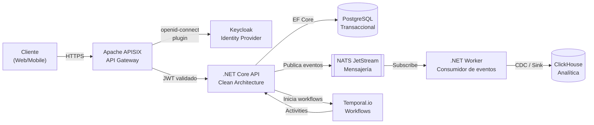
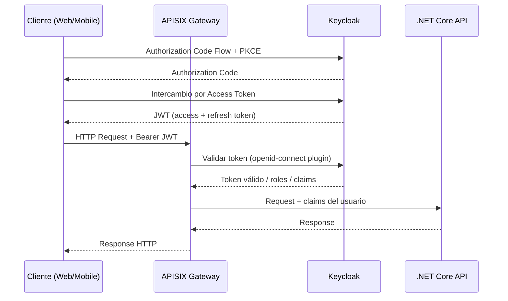
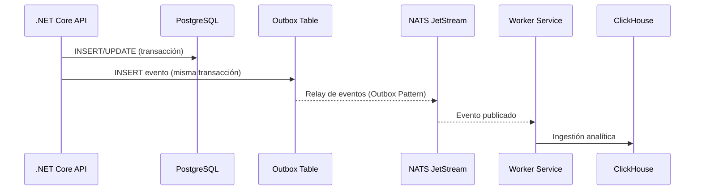

# ARCHITECTURE.md — [Nombre del Servicio]

> Generado con GitHub Copilot usando el stack ForzaTech v3.
> Actualizar este archivo en cada cambio arquitectónico significativo.

---

## Descripción del Servicio

**Nombre:** `[nombre-servicio]`
**Dominio:** `[dominio de negocio, ej: Pagos / Facturación / Operaciones]`
**Track:** Legacy / Innovación
**Responsable:** [Tech Lead del equipo]
**Última actualización:** [fecha]

Descripción breve del propósito del servicio y los problemas de negocio que resuelve.

---

## Arquitectura General



---

## Flujo de Autenticación



---

## Flujo de Eventos (Event-Driven)



---

## Stack de Dependencias

### Runtime

| Componente | Tecnología | Versión | Notas |
|------------|-----------|---------|-------|
| Framework  | .NET Core | 8.0 LTS | `net8.0` target |
| ORM        | Entity Framework Core | 8.x | Migrations en `/Infrastructure/Migrations` |
| CQRS       | MediatR | 12.x | Commands y Queries en `/Application` |
| Mensajería | NATS.Net | 2.x | JetStream habilitado |
| Resiliencia| Polly | 8.x | Retry + Circuit Breaker en calls externos |
| Logging    | Serilog | 3.x | JSON estructurado + Application Insights |
| Tests      | xUnit + Moq | Latest | Cobertura mínima: 80% |

### Infraestructura

| Componente | Herramienta | Configuración |
|------------|------------|---------------|
| API Gateway | Apache APISIX | `apisix/routes.yaml` (versionado en Git) |
| Identity   | Keycloak | Realm: `forza-[entorno]` |
| Orquestación | Kubernetes + Rancher | Namespace: `[entorno]-[servicio]` |
| CI/CD      | GitHub Actions | `.github/workflows/` |
| Calidad    | Codacy | Gate: sin issues Críticos/Altos |
| Imágenes   | GitHub Container Registry (GHCR) | Tag semántico: `v1.2.3-sha` |

---

## Estructura del Proyecto (Clean Architecture)

```
src/
├── Domain/                    # Entidades, Value Objects, interfaces
│   ├── Entities/
│   ├── ValueObjects/
│   └── Interfaces/
├── Application/               # Casos de uso (CQRS con MediatR)
│   ├── Commands/
│   ├── Queries/
│   ├── DTOs/
│   └── Interfaces/
├── Infrastructure/            # Implementaciones concretas
│   ├── Persistence/           # EF Core, repositorios, migrations
│   ├── Messaging/             # NATS, Temporal workflows
│   └── ExternalServices/      # Clientes HTTP externos
└── Presentation/              # Controllers, middlewares
    ├── Controllers/
    └── Middleware/

tests/
├── UnitTests/                 # xUnit + Moq
└── IntegrationTests/          # Tests de endpoints y flujos
```

---

## Convenciones de Naming en este Servicio

```csharp
// Commands y Queries
CreateTransactionCommand       // Command (escribe estado)
GetTransactionByIdQuery        // Query (solo lectura)
CreateTransactionCommandHandler

// Entidades y Value Objects
Transaction                    // Entidad principal
TransactionId                  // Value Object (Id tipado)
Money                          // Value Object

// Repositorios
ITransactionRepository         // Interfaz en Domain
TransactionRepository          // Implementación en Infrastructure

// NATS Subjects (dominio.entidad.accion)
pagos.transaccion.creada
pagos.transaccion.procesada
pagos.transaccion.fallida
```

---

## Variables de Entorno Requeridas

> Los valores NUNCA van en el código ni en Git. Usar Vault o K8s Secrets.

```bash
# Base de datos
ConnectionStrings__DefaultConnection=   # Vault: secret/pagos/pg-connection

# Keycloak
Keycloak__Authority=                    # https://keycloak.forzatech.com/realms/forza-prod
Keycloak__Audience=                     # nombre-servicio

# NATS
Nats__Url=                              # nats://nats.forzatech.svc.cluster.local:4222

# Temporal
Temporal__HostPort=                     # temporal.forzatech.svc.cluster.local:7233
```

---

## Pipeline CI/CD

Ver `.github/workflows/ci.yaml` para el pipeline completo.

```
PR abierto
  └─> Codacy (gate: sin Críticos/Altos)
  └─> Build .NET
  └─> Tests unitarios (cobertura >= 80%)
  └─> Trivy scan (imagen Docker)

Merge a main
  └─> Build imagen Docker multi-stage
  └─> Push a GHCR con tag v{semver}-{sha}
  └─> Deploy automático a dev/staging
  └─> Smoke tests

Deploy a producción
  └─> Gate manual (GitHub Environments)
  └─> Rancher Fleet sincroniza desde Git
  └─> Notificación al equipo
```

---

## ADRs (Architecture Decision Records)

| Decisión | Fecha | Estado | Documento |
|----------|-------|--------|-----------|
| Usar NATS en lugar de RabbitMQ | 2025-Q1 | Aceptado | `docs/adr/001-nats-vs-rabbitmq.md` |
| Clean Architecture como base | 2024-Q3 | Aceptado | `docs/adr/002-clean-architecture.md` |
| Temporal para workflows largos | 2025-Q2 | Aceptado | `docs/adr/003-temporal-workflows.md` |

---

## Servicios y Dominios Documentados

| Servicio | Dominio | Documento |
|---|---|---|
| `forza-facturacion` | Finanzas / Facturación FEL | [docs/facturacion-fel/ARCHITECTURE.md](docs/facturacion-fel/ARCHITECTURE.md) |
| `forza-firma-electronica` | Seguridad / Firma Digital | [docs/firma-electronica/ARCHITECTURE.md](docs/firma-electronica/ARCHITECTURE.md) |
| `forza-vacaciones` | RRHH / Gestión de Vacaciones | [docs/vacaciones/ARCHITECTURE.md](docs/vacaciones/ARCHITECTURE.md) |
| `forza-pay` | Finanzas / Pasarela de Pagos | [docs/pasarela-pagos/ARCHITECTURE.md](docs/pasarela-pagos/ARCHITECTURE.md) |

---

*Generado con GitHub Copilot usando `.github/copilot-instructions.md` del repositorio*
*Stack: ForzaTech v3 — Referencia: Política_Forza_Tech_v3.docx*
