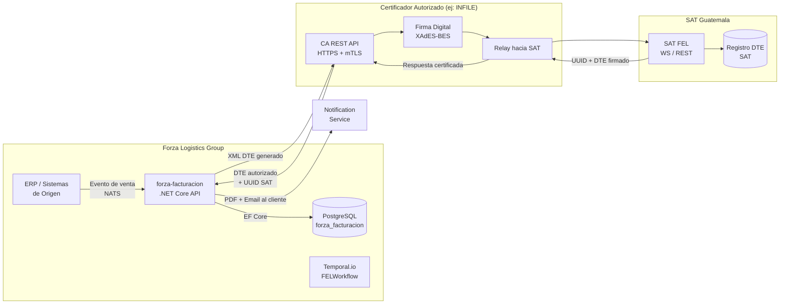
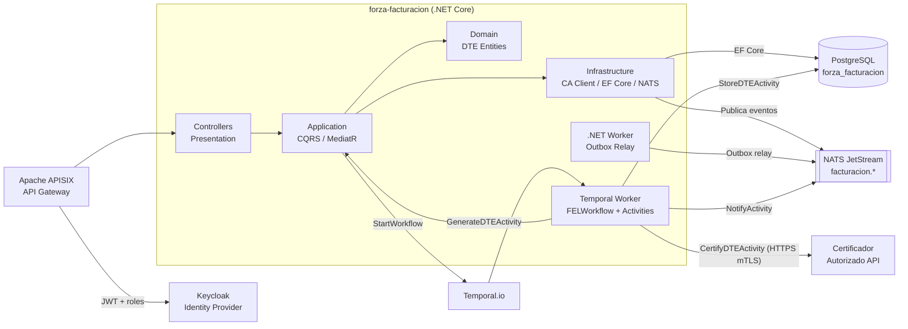
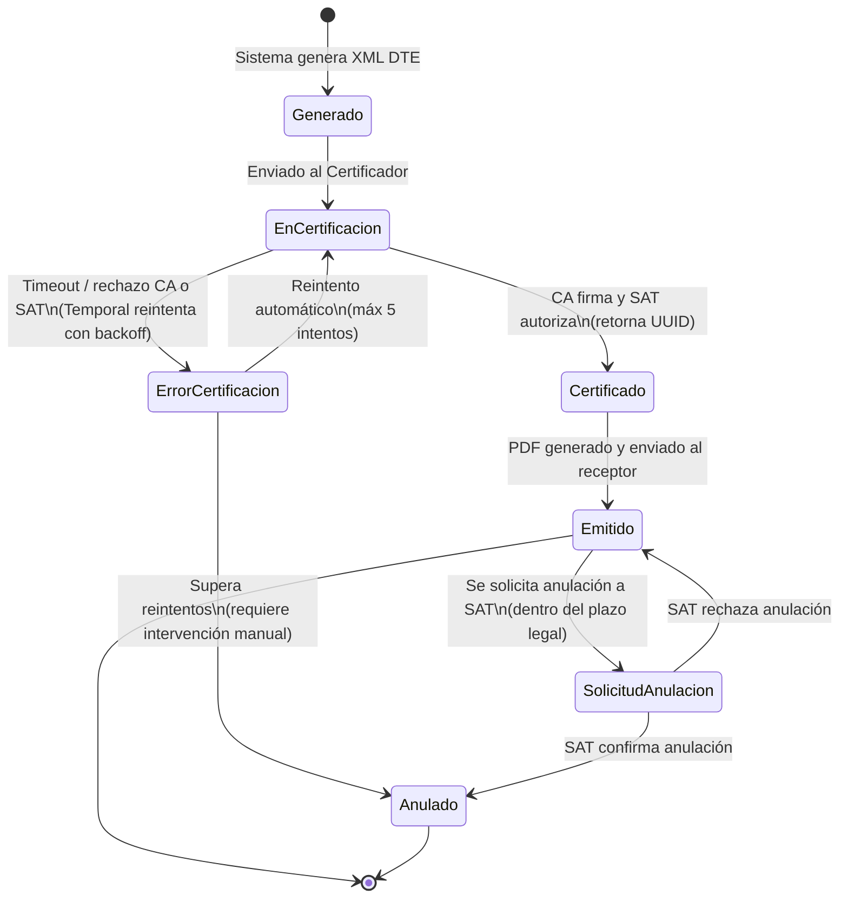
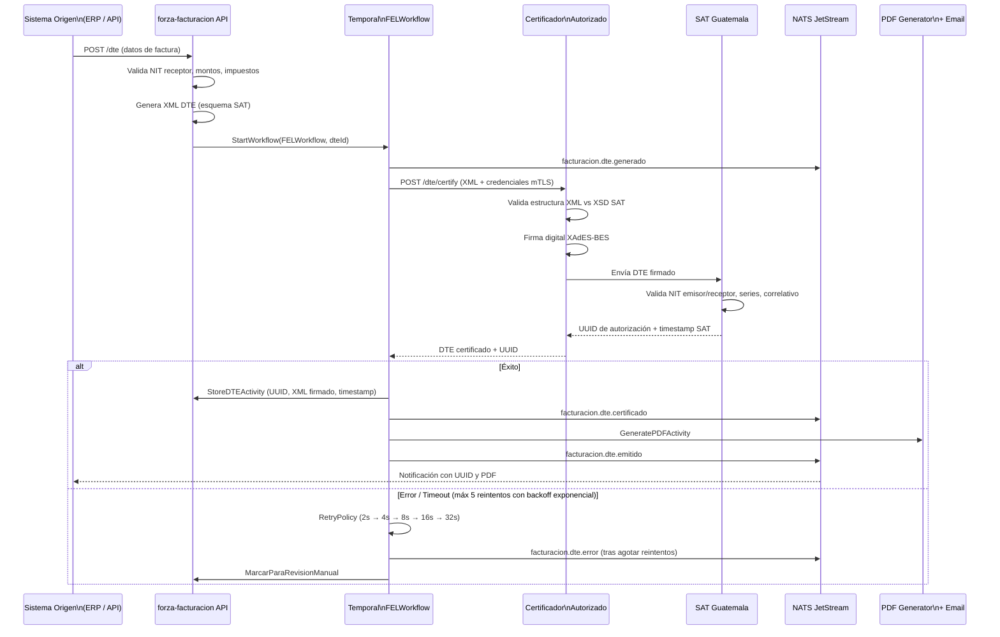
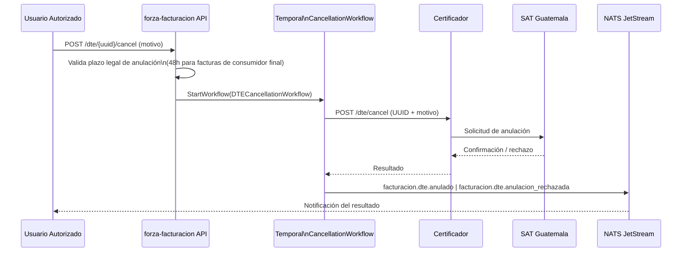
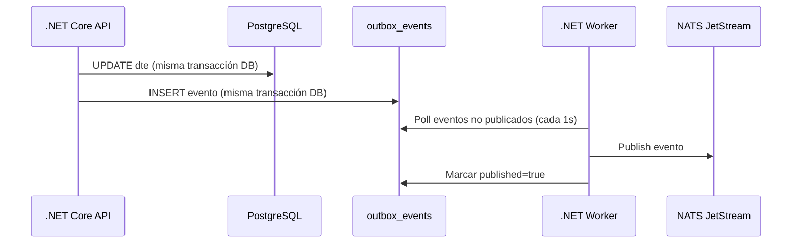
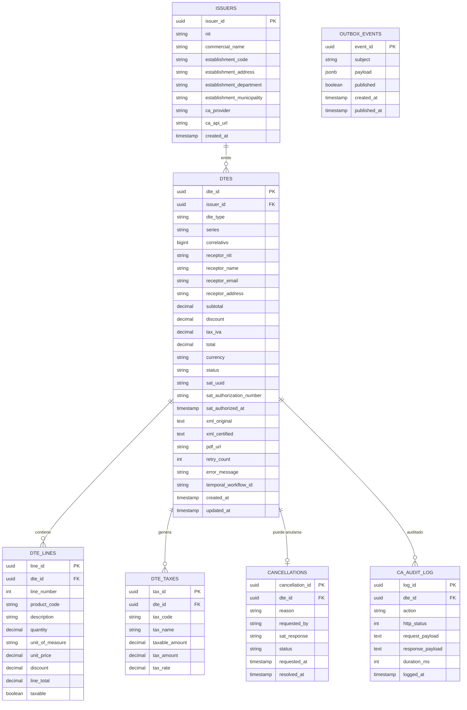
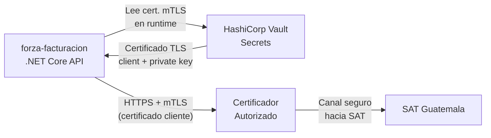

# ARCHITECTURE.md — Facturación Electrónica FEL (SAT Guatemala)

> Generado con GitHub Copilot usando el stack ForzaTech v3.
> Actualizar este archivo en cada cambio arquitectónico significativo.

---

## Descripción del Servicio

**Nombre:** `forza-facturacion`
**Dominio:** `Finanzas / Facturación`
**Track:** Innovación
**Responsable:** David Salas — Gerente de Desarrollo y Tecnología
**Última actualización:** 2026-04-27

Servicio de facturación electrónica en línea (**FEL**) que integra Forza Logistics Group con la **SAT Guatemala** a través de un **Certificador Autorizado** (CA). Genera, firma, certifica y almacena Documentos Tributarios Electrónicos (DTE) cumpliendo con el Acuerdo de Directorio SAT 22-2018 y sus reformas.

El flujo es orquestado con **Temporal.io** para garantizar que ningún paso se pierda ante fallos externos (timeout con SAT, caída del certificador, etc.). Todos los eventos de ciclo de vida del DTE se publican vía **NATS JetStream**.

---

## Contexto: Ecosistema FEL Guatemala



---

## Arquitectura Interna del Servicio



---

## Tipos de DTE Soportados

| Código SAT | Tipo | Descripción |
|------------|------|-------------|
| `FACT` | Factura | Factura estándar de venta |
| `FCAM` | Factura Cambiaria | Con letra de cambio |
| `FPEQ` | Factura Pequeño Contribuyente | Régimen simplificado |
| `NCRE` | Nota de Crédito | Devolución / descuento posterior |
| `NDEB` | Nota de Débito | Cargo adicional sobre factura |
| `NABN` | Nota de Abono | Abono a cuenta |
| `RDON` | Recibo por Donación | Para entidades exentas |

---

## Estados del Ciclo de Vida del DTE



---

## Flujo de Certificación FEL (Temporal Workflow)



---

## Flujo de Anulación de DTE



---

## Outbox Pattern — Garantía de Entrega



---

## Modelo de Datos



---

## Seguridad en la Integración con el Certificador



**Consideraciones de seguridad:**
- Credenciales del CA almacenadas en **HashiCorp Vault** — nunca en código ni variables de entorno en texto plano
- Certificado digital del emisor (`.pfx`) en Vault — rotación anual según requisito SAT
- mTLS en la comunicación con el CA
- Audit log de **todas** las llamadas hacia el CA en `ca_audit_log`
- Rate limiting en APISIX para los endpoints de emisión (`/dte`)
- Validación de NIT contra el API del CA antes de emitir
- Los XML de DTE (originales y certificados) se almacenan cifrados en PostgreSQL

---

## Stack de Dependencias

### Runtime

| Componente | Tecnología | Versión | Notas |
|------------|-----------|---------|-------|
| Framework | .NET Core | 8.0 LTS | `net8.0` |
| ORM | Entity Framework Core | 8.x | Migrations versionadas |
| CQRS | MediatR | 12.x | Commands/Queries por tipo DTE |
| Workflows | Temporalio SDK | 1.x | `FELWorkflow`, `DTECancellationWorkflow` |
| HTTP Client | HttpClientFactory + Polly | 8.x | Retry + timeout para llamadas al CA |
| XML | System.Xml / XmlSerializer | .NET | Generación y validación vs XSD SAT |
| PDF | QuestPDF | 2024.x | Generación de PDF del DTE |
| Mensajería | NATS.Net | 2.x | JetStream — subjects `facturacion.*` |
| Logging | Serilog | 3.x | JSON + correlationId por DTE |
| Tests | xUnit + Moq | Latest | Mock del CA API para tests unitarios |

### Infraestructura

| Componente | Herramienta | Configuración |
|------------|------------|---------------|
| API Gateway | Apache APISIX | Rate limiting en `/dte`, auth Keycloak |
| Identity | Keycloak | Roles: `billing_user`, `billing_admin`, `billing_viewer` |
| Secrets | HashiCorp Vault | Certs mTLS, API keys del CA, cert. digital emisor |
| Workflows | Temporal.io | Namespace: `forza-facturacion` |
| Orquestación | Kubernetes + Rancher | Namespace: `prod-facturacion` |
| CI/CD | GitHub Actions | `.github/workflows/ci-facturacion.yaml` |

---

## Estructura del Proyecto (Clean Architecture)

```
src/
├── ForzaFacturacion.Domain/
│   ├── Entities/
│   │   ├── DTE.cs
│   │   ├── DTELine.cs
│   │   ├── DTETax.cs
│   │   ├── Cancellation.cs
│   │   └── Issuer.cs
│   ├── ValueObjects/
│   │   ├── Nit.cs                  # Validación NIT Guatemala
│   │   ├── DTEId.cs
│   │   └── Money.cs
│   ├── Enums/
│   │   ├── DTEType.cs              # FACT, NCRE, NDEB, etc.
│   │   └── DTEStatus.cs
│   └── Interfaces/
│       ├── IDTERepository.cs
│       └── IIssuerRepository.cs
│
├── ForzaFacturacion.Application/
│   ├── Commands/
│   │   ├── IssueDTE/
│   │   │   ├── IssueDTECommand.cs
│   │   │   └── IssueDTECommandHandler.cs
│   │   ├── CancelDTE/
│   │   │   ├── CancelDTECommand.cs
│   │   │   └── CancelDTECommandHandler.cs
│   │   └── RetryFailedDTE/
│   ├── Queries/
│   │   ├── GetDTEByUuid/
│   │   ├── GetDTEsByPeriod/
│   │   └── GetDTEStatus/
│   ├── DTOs/
│   │   ├── IssueDTERequest.cs
│   │   ├── DTEResponse.cs
│   │   └── CancellationRequest.cs
│   └── Interfaces/
│       ├── ICertifierClient.cs     # Puerto hacia el CA
│       └── IXmlDTEGenerator.cs
│
├── ForzaFacturacion.Infrastructure/
│   ├── Persistence/
│   │   ├── AppDbContext.cs
│   │   ├── Migrations/
│   │   ├── Repositories/
│   │   └── OutboxRelay/
│   ├── Certifier/
│   │   ├── InfileCertifierClient.cs    # Implementación para INFILE
│   │   ├── DTEXmlGenerator.cs          # Genera XML vs XSD SAT
│   │   └── XsdValidator.cs             # Valida XML antes de enviar
│   ├── Temporal/
│   │   ├── Workflows/
│   │   │   ├── FELWorkflow.cs
│   │   │   └── DTECancellationWorkflow.cs
│   │   └── Activities/
│   │       ├── GenerateDTEXmlActivity.cs
│   │       ├── CertifyDTEActivity.cs
│   │       ├── StoreCertifiedDTEActivity.cs
│   │       ├── GeneratePDFActivity.cs
│   │       └── NotifyEmissionActivity.cs
│   ├── Pdf/
│   │   └── DTEPdfGenerator.cs
│   └── Messaging/
│       └── NatsPublisher.cs
│
└── ForzaFacturacion.Presentation/
    ├── Controllers/
    │   ├── DTEController.cs
    │   └── CancellationsController.cs
    └── Middleware/
        └── DTECorrelationMiddleware.cs

tests/
├── ForzaFacturacion.UnitTests/
│   ├── Domain/
│   │   └── NitValidationTests.cs
│   ├── Application/
│   │   └── IssueDTECommandHandlerTests.cs
│   └── Infrastructure/
│       └── DTEXmlGeneratorTests.cs     # Valida XML generado vs XSD SAT
└── ForzaFacturacion.IntegrationTests/
    └── CertifierClientTests.cs         # Contra sandbox del CA
```

---

## Endpoints Principales (REST)

| Método | Ruta | Rol | Descripción |
|--------|------|-----|-------------|
| `POST` | `/dte` | `billing_user` | Emitir DTE (factura, nota crédito, etc.) |
| `GET` | `/dte/{uuid}` | `billing_viewer` | Obtener DTE por UUID SAT |
| `GET` | `/dte/{uuid}/pdf` | `billing_viewer` | Descargar PDF del DTE |
| `GET` | `/dte/{uuid}/xml` | `billing_viewer` | Descargar XML certificado |
| `POST` | `/dte/{uuid}/cancel` | `billing_admin` | Solicitar anulación ante SAT |
| `GET` | `/dte/status/{dteId}` | `billing_viewer` | Estado del workflow en Temporal |
| `GET` | `/dte?from=&to=&status=` | `billing_viewer` | Listar DTE por período/estado |
| `POST` | `/dte/{dteId}/retry` | `billing_admin` | Reintentar DTE con error manual |
| `GET` | `/issuers/{id}` | `billing_admin` | Datos del emisor registrado |

---

## NATS Subjects

```
facturacion.dte.generado          → DTE creado, XML listo para certificar
facturacion.dte.certificado       → CA devolvió UUID SAT
facturacion.dte.emitido           → PDF generado y enviado al receptor
facturacion.dte.error             → Falló certificación tras reintentos
facturacion.dte.anulado           → SAT confirmó anulación
facturacion.dte.anulacion_rechazada → SAT rechazó la anulación
```

---

## Variables de Entorno Requeridas

> Los valores NUNCA van en código ni Git. Todos en HashiCorp Vault.

```bash
# Base de datos
ConnectionStrings__DefaultConnection=   # Vault: secret/facturacion/pg-connection

# Keycloak
Keycloak__Authority=                    # https://keycloak.forzatech.com/realms/forza-prod
Keycloak__Audience=                     # forza-facturacion

# Certificador Autorizado (ej: INFILE)
Certifier__ApiUrl=                      # Vault: secret/facturacion/ca-url
Certifier__ApiKey=                      # Vault: secret/facturacion/ca-apikey
Certifier__ClientCertPath=              # Vault: secret/facturacion/mtls-cert
Certifier__ClientCertPassword=          # Vault: secret/facturacion/mtls-cert-pass

# Certificado Digital del Emisor (firma DTE)
Issuer__CertificatePfxPath=             # Vault: secret/facturacion/issuer-pfx
Issuer__CertificatePassword=            # Vault: secret/facturacion/issuer-pfx-pass

# NATS
Nats__Url=                              # nats://nats.forzatech.svc.cluster.local:4222
Nats__StreamName=                       # FACTURACION

# Temporal
Temporal__HostPort=                     # temporal.forzatech.svc.cluster.local:7233
Temporal__Namespace=                    # forza-facturacion

# Almacenamiento PDF
Storage__BlobUrl=                       # Vault: secret/facturacion/blob-url
```

---

## Pipeline CI/CD

```
PR abierto
  └─> Codacy (gate: sin Críticos/Altos)
  └─> Build .NET
  └─> Tests unitarios (cobertura >= 80%)
      └─> Incluye validación de XML generado vs XSD oficial SAT
  └─> Tests de integración contra sandbox del Certificador
  └─> Trivy scan imagen Docker

Merge a main
  └─> Build imagen Docker multi-stage
  └─> Push a GHCR: ghcr.io/forzatech/forza-facturacion:v{semver}-{sha}
  └─> Deploy a staging (Rancher Fleet)
  └─> Smoke test: emitir DTE de prueba en ambiente sandbox SAT

Deploy a producción
  └─> Gate manual (GitHub Environments: producción)
  └─> Rancher Fleet sincroniza desde Git
  └─> Smoke test con DTE real (monto Q0.01 en ambiente live)
  └─> Notificación al equipo
```

---

## ADRs (Architecture Decision Records)

| Decisión | Fecha | Estado | Documento |
|----------|-------|--------|-----------|
| Usar Certificador Autorizado (CA) como intermediario vs integración directa SAT | 2026-04-27 | Aceptado | `docs/adr/001-certificador-autorizado.md` |
| Temporal.io para orquestar el flujo FEL con reintentos | 2026-04-27 | Aceptado | `docs/adr/002-temporal-fel-workflow.md` |
| Almacenar XML certificado y original en PostgreSQL (cifrado) | 2026-04-27 | Aceptado | `docs/adr/003-storage-xml-dte.md` |
| QuestPDF para generación de representación impresa del DTE | 2026-04-27 | Aceptado | `docs/adr/004-questpdf-dte.md` |

---

## Notas Regulatorias SAT Guatemala

- **Régimen FEL:** obligatorio para contribuyentes según Resolución SAT
- **XSD oficial:** disponible en el portal SAT — validar en tiempo de compilación y en runtime
- **UUID SAT:** identificador único del DTE, requerido en anulaciones y en notas de crédito/débito asociadas a una factura
- **Plazo de anulación:** varía por tipo de DTE — verificar normativa vigente con área legal
- **Series y correlativos:** gestionados por el CA — no reiniciar correlativos sin coordinación con SAT
- **Retención de XML:** obligatorio conservar los XML certificados por **4 años** según Código Tributario
- **Ambiente de pruebas:** el CA provee un sandbox; SAT también tiene ambiente de homologación — usar en CI/CD

---

*Generado con GitHub Copilot usando `.github/copilot-instructions.md` del repositorio*
*Stack: ForzaTech v3 — Referencia: Política_Forza_Tech_v3.docx*
