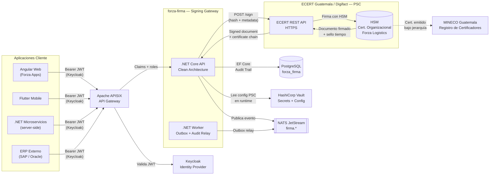
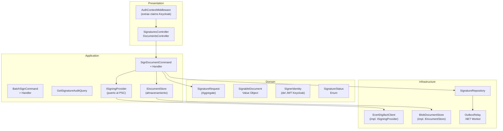
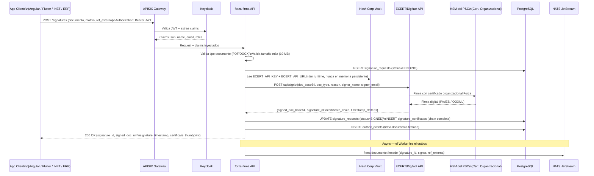
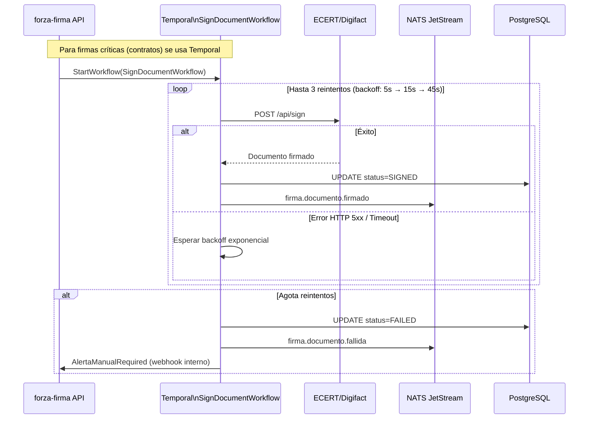
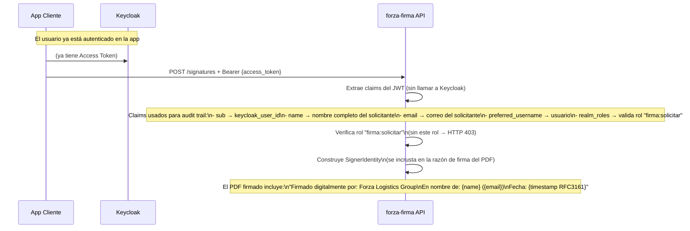
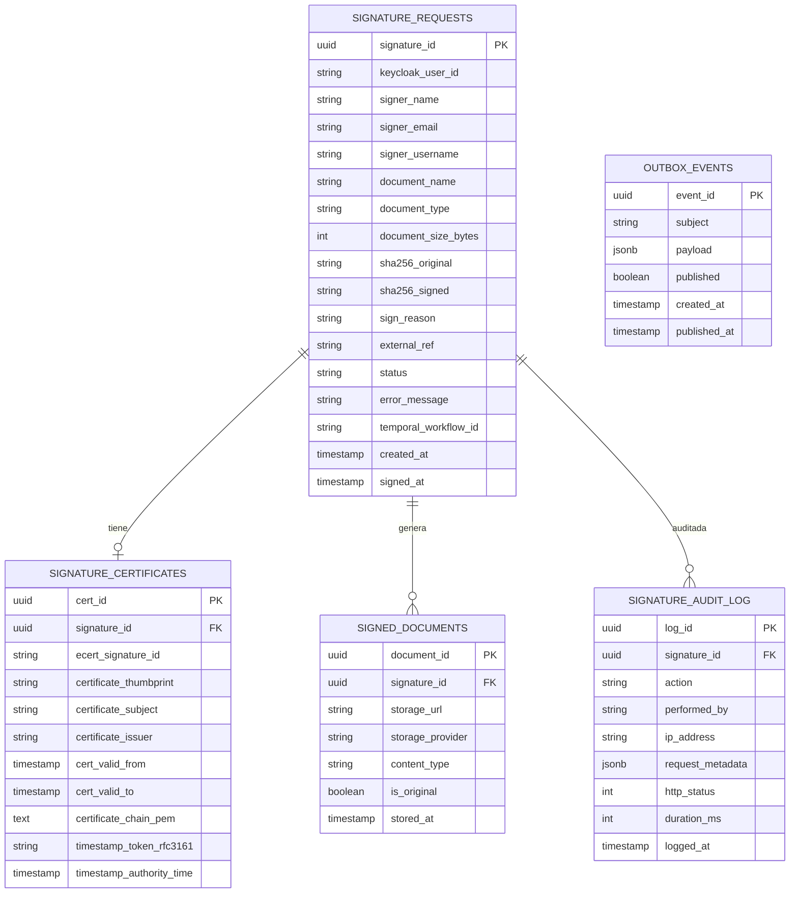

# ARCHITECTURE.md — Firma Electrónica Gateway (forza-firma)

> Generado con GitHub Copilot usando el stack ForzaTech v3.
> Actualizar este archivo en cada cambio arquitectónico significativo.

---

## Descripción del Servicio

**Nombre:** `forza-firma`
**Dominio:** `Legal / Seguridad / Transversal`
**Track:** Innovación
**PSC (Proveedor de Firma):** ECERT Guatemala / Digifact
**Base Legal:** Decreto 47-2008 — Ley para el Reconocimiento de las Comunicaciones y Firmas Electrónicas (LRCFE) + Reglamento MINECO
**Responsable:** David Salas — Gerente de Desarrollo y Tecnología
**Última actualización:** 2026-04-27

Microservicio **centralizado** que actúa como **gateway de firma electrónica** para todo el ecosistema Forza Logistics Group. Cualquier aplicación (Angular, Flutter, microservicio .NET, ERP externo) puede solicitar una firma electrónica avanzada sin necesidad de gestionar certificados ni credenciales del PSC directamente.

**Flujo principal:**
1. La app cliente llama a `forza-firma` con un JWT de Keycloak (identidad del solicitante) y el documento a firmar
2. `forza-firma` valida el JWT, extrae los claims de identidad y autorización
3. Registra la solicitud en base de datos para audit trail irrefutable
4. Llama a ECERT/Digifact API con el certificado organizacional de Forza (almacenado en su HSM)
5. Retorna el documento firmado (PDF/PAdES o Word/OOXML) y el comprobante de firma
6. Publica el evento de firma vía NATS JetStream para trazabilidad cross-sistema

---

## Contexto: Ecosistema de Firma Electrónica



---

## Arquitectura Interna del Gateway



---

## Flujo de Firma — Happy Path



---

## Flujo de Error y Retry (Temporal.io)



---

## Validación de Identidad del Firmante (Keycloak)



---

## Roles Keycloak para forza-firma

| Rol | Descripción |
|-----|-------------|
| `firma:solicitar` | Puede solicitar firma de documentos vía API |
| `firma:batch` | Puede firmar múltiples documentos en lote |
| `firma:admin` | Gestión de configuración, certificados, auditoría |
| `firma:auditor` | Solo lectura del audit trail completo |

> Los roles se asignan en el realm de Keycloak y llegan en el claim `realm_access.roles` del JWT.

---

## Modelo de Datos



---

## Integración con ECERT Guatemala / Digifact — Detalle Técnico

> La documentación de integración detallada debe solicitarse directamente a ECERT/Digifact durante el proceso de contratación. Los endpoints y payload a continuación representan el patrón REST típico de PSCs guatemaltecos homologados.

### Ambientes

| Ambiente | URL Base |
|----------|----------|
| **Sandbox** | `https://sandbox-api.ecert.com.gt/v1/` |
| **Producción** | `https://api.ecert.com.gt/v1/` |

### Autenticación ECERT (Bearer Token)

```http
POST /auth/token HTTP/1.1
Host: api.ecert.com.gt
Content-Type: application/json

{
  "client_id": "{ECERT_CLIENT_ID}",
  "client_secret": "{ECERT_CLIENT_SECRET}"
}
```

```json
{
  "access_token": "eyJhbGci...",
  "expires_in": 3600
}
```

### Endpoint de Firma de Documento

```http
POST /api/v1/sign HTTP/1.1
Host: api.ecert.com.gt
Authorization: Bearer {ecert_access_token}
Content-Type: application/json

{
  "document": "{base64_documento}",
  "document_type": "PDF",
  "signature_reason": "Aprobado por: David Salas | Forza Logistics Group",
  "signature_location": "Guatemala City, Guatemala",
  "signer_name": "{name_from_keycloak_claim}",
  "signer_email": "{email_from_keycloak_claim}",
  "include_timestamp": true,
  "signature_level": "ADVANCED"
}
```

### Respuesta exitosa

```json
{
  "signature_id": "ecert-uuid-xxxx",
  "signed_document": "{base64_documento_firmado}",
  "certificate": {
    "thumbprint": "SHA256:AABB...",
    "subject": "CN=Forza Logistics Group, O=Forza, C=GT",
    "issuer": "CN=ECERT CA Guatemala",
    "valid_from": "2026-01-01T00:00:00Z",
    "valid_to": "2027-01-01T00:00:00Z",
    "chain": ["-----BEGIN CERTIFICATE-----..."]
  },
  "timestamp": {
    "rfc3161_token": "MIIHpQ...",
    "time": "2026-04-27T10:00:00.000-06:00",
    "authority": "TSA ECERT Guatemala"
  }
}
```

---

## Formatos de Firma por Tipo de Documento

| Tipo | Estándar de Firma | Descripción |
|------|-------------------|-------------|
| PDF | **PAdES** (PDF Advanced Electronic Signature) | Firma embebida en el PDF, visible y verificable con Adobe Reader |
| Word / DOCX | **OOXML Signature** (XML DSig) | Firma incrustada en el package Office, verificable en Word |
| Cualquier archivo | **CAdES-detached** | Firma externa `.p7s` acompañando al archivo original |

---

## Endpoints del Gateway (REST)

| Método | Ruta | Rol | Descripción |
|--------|------|-----|-------------|
| `POST` | `/signatures` | `firma:solicitar` | Firmar un documento (PDF o DOCX) |
| `POST` | `/signatures/batch` | `firma:batch` | Firmar múltiples documentos en lote |
| `GET` | `/signatures/{id}` | `firma:solicitar` | Estado y resultado de una firma |
| `GET` | `/signatures/{id}/download` | `firma:solicitar` | Descargar documento firmado |
| `GET` | `/signatures/{id}/certificate` | `firma:solicitar` | Certificado y cadena de confianza |
| `GET` | `/signatures/audit?from=&to=` | `firma:auditor` | Audit trail por período |
| `POST` | `/signatures/{id}/verify` | `firma:solicitar` | Verificar validez de una firma existente |

---

## Estructura del Proyecto (Clean Architecture)

```
src/
├── ForzaFirma.Domain/
│   ├── Entities/
│   │   ├── SignatureRequest.cs          # Aggregate root
│   │   └── SignatureCertificate.cs
│   ├── ValueObjects/
│   │   ├── SignableDocument.cs          # Encapsula doc + hash + tipo
│   │   ├── SignerIdentity.cs            # Construida desde claims Keycloak
│   │   └── SignatureId.cs
│   ├── Enums/
│   │   ├── SignatureStatus.cs           # PENDING, SIGNED, FAILED
│   │   └── DocumentType.cs             # PDF, DOCX
│   └── Interfaces/
│       ├── ISignatureRepository.cs
│       └── ISigningProvider.cs          # Puerto hacia el PSC
│
├── ForzaFirma.Application/
│   ├── Commands/
│   │   ├── SignDocument/
│   │   │   ├── SignDocumentCommand.cs   # {document_base64, reason, external_ref}
│   │   │   └── SignDocumentCommandHandler.cs
│   │   └── BatchSign/
│   ├── Queries/
│   │   ├── GetSignatureById/
│   │   └── GetAuditTrail/
│   ├── DTOs/
│   │   ├── SignDocumentRequest.cs
│   │   └── SignDocumentResponse.cs
│   └── Interfaces/
│       ├── ICurrentSigner.cs            # Abstracción sobre claims Keycloak
│       └── IDocumentStore.cs
│
├── ForzaFirma.Infrastructure/
│   ├── Persistence/
│   │   ├── AppDbContext.cs
│   │   ├── Migrations/
│   │   ├── Repositories/
│   │   └── OutboxRelay/
│   ├── Signing/
│   │   ├── EcertDigifactClient.cs       # Impl. ISigningProvider para ECERT
│   │   ├── EcertTokenCache.cs           # Caché del access_token ECERT (TTL)
│   │   └── DocumentHasher.cs           # SHA-256 antes/después de firma
│   ├── Storage/
│   │   └── BlobDocumentStore.cs        # Guarda doc firmado (S3 / Azure Blob)
│   ├── Temporal/
│   │   ├── Workflows/
│   │   │   └── SignDocumentWorkflow.cs  # Para firmas críticas con retry
│   │   └── Activities/
│   │       ├── SignWithEcertActivity.cs
│   │       └── StoreSignedDocumentActivity.cs
│   ├── Auth/
│   │   └── KeycloakCurrentSigner.cs    # Extrae SignerIdentity del HttpContext
│   └── Messaging/
│       └── NatsPublisher.cs
│
└── ForzaFirma.Presentation/
    ├── Controllers/
    │   ├── SignaturesController.cs
    │   └── AuditController.cs
    └── Middleware/
        └── SignerContextMiddleware.cs   # Construye ICurrentSigner desde JWT

tests/
├── ForzaFirma.UnitTests/
│   ├── Domain/
│   │   └── SignerIdentityTests.cs
│   └── Application/
│       └── SignDocumentCommandHandlerTests.cs   # Mock de ISigningProvider
└── ForzaFirma.IntegrationTests/
    └── EcertClientTests.cs              # Contra sandbox ECERT
```

---

## NATS Subjects

```
firma.documento.firmado           → Documento firmado exitosamente
firma.documento.fallida           → Firma falló tras reintentos
firma.documento.verificado        → Verificación de firma realizada
firma.batch.completado            → Lote de firmas completado
```

---

## Variables de Entorno Requeridas

> Todos los valores en HashiCorp Vault. Nunca en código ni Git.

```bash
# Keycloak (validación JWT — solo configuración, no secretos)
Keycloak__Authority=              # https://keycloak.forzatech.com/realms/forza-prod
Keycloak__Audience=               # forza-firma

# ECERT / Digifact — PSC Guatemala
Ecert__ApiUrl=                    # Vault: secret/firma/ecert-url
Ecert__ClientId=                  # Vault: secret/firma/ecert-client-id
Ecert__ClientSecret=              # Vault: secret/firma/ecert-client-secret
Ecert__TokenCacheTtlSeconds=      # 3300 (5 min antes de expiración)

# Base de datos
ConnectionStrings__DefaultConnection=  # Vault: secret/firma/pg-connection

# Almacenamiento de documentos firmados
Storage__Provider=                # S3 | AzureBlob | LocalFS (solo dev)
Storage__ConnectionString=        # Vault: secret/firma/storage-conn

# NATS
Nats__Url=                        # nats://nats.forzatech.svc.cluster.local:4222
Nats__StreamName=                 # FIRMA

# Temporal (solo para firmas críticas)
Temporal__HostPort=               # temporal.forzatech.svc.cluster.local:7233
Temporal__Namespace=              # forza-firma
```

---

## Consideraciones de Seguridad

| Área | Medida |
|------|--------|
| **Identidad** | JWT validado por Keycloak en APISIX antes de llegar al servicio |
| **Autorización** | Rol `firma:solicitar` obligatorio — sin él HTTP 403 |
| **Audit trail** | Cada solicitud de firma registrada con: quién, qué doc (hash SHA-256), cuándo, desde qué IP |
| **No repudio** | La firma incluye timestamp RFC3161 de TSA del PSC — irrefutable ante terceros |
| **Documentos** | Solo se almacena el hash del doc original + el doc firmado — nunca en logs |
| **Credenciales PSC** | `client_id` y `client_secret` de ECERT en Vault, leídos en runtime |
| **Token ECERT** | Cacheado en memoria con TTL seguro — nunca persiste en BD |
| **Tamaño** | Límite 10 MB por documento — validación antes de llamar al PSC |
| **TLS** | TLS 1.2+ obligatorio en todas las llamadas a ECERT |

---

## Pipeline CI/CD

```
PR abierto
  └─> Codacy (gate: sin Críticos/Altos)
  └─> Build .NET
  └─> Tests unitarios — ISigningProvider mockeado (cobertura >= 80%)
  └─> Tests de integración contra sandbox ECERT
  └─> Trivy scan imagen Docker

Merge a main
  └─> Build imagen Docker multi-stage
  └─> Push GHCR: ghcr.io/forzatech/forza-firma:v{semver}-{sha}
  └─> Deploy a staging
  └─> Smoke test: firmar PDF de prueba → verificar PAdES válido

Deploy a producción
  └─> Gate manual (GitHub Environments: producción)
  └─> Rancher Fleet sincroniza desde Git
  └─> Notificación al equipo
```

---

## ADRs (Architecture Decision Records)

| Decisión | Fecha | Estado | Documento |
|----------|-------|--------|-----------|
| Gateway centralizado vs. integración directa en cada app | 2026-04-27 | Aceptado | `docs/adr/001-gateway-firma-centralizado.md` |
| Certificado organizacional único vs. certificados personales por empleado | 2026-04-27 | Aceptado | `docs/adr/002-certificado-organizacional.md` |
| Usar ECERT/Digifact como PSC vs. Prisma/INFILE | 2026-04-27 | Aceptado | `docs/adr/003-ecert-como-psc.md` |
| Temporal.io solo para firmas críticas (contratos), REST directo para resto | 2026-04-27 | Aceptado | `docs/adr/004-temporal-firmas-criticas.md` |
| SignerIdentity derivada de JWT Keycloak — no se almacena contraseña ni PIN del firmante | 2026-04-27 | Aceptado | `docs/adr/005-signer-identity-keycloak.md` |

---

## Notas Regulatorias — Guatemala

- **Marco legal:** Decreto 47-2008 (LRCFE) + Acuerdo Gubernativo 135-2009 (Reglamento)
- **Certificadores autorizados:** inscritos en el Registro de Certificadores del **MINECO**
- **Firma avanzada** = certeza de identidad + integridad del documento + no repudio + sello de tiempo
- El certificado organizacional de Forza debe **renovarse anualmente** — agregar alerta en sistema de monitoreo
- Los documentos firmados deben conservarse el tiempo que exija la norma aplicable (contratos: mínimo 5 años)
- La razón de firma (`signature_reason`) debe incluir nombre y cargo del empleado que la solicitó — se extrae del JWT Keycloak

---

*Generado con GitHub Copilot usando `.github/copilot-instructions.md` del repositorio*
*Stack: ForzaTech v3 — Referencia: Política_Forza_Tech_v3.docx*
