# ARCHITECTURE.md — Forza Pay — Pasarela de Pagos Centralizada

> Generado con GitHub Copilot usando el stack ForzaTech v3.
> Actualizar este archivo en cada cambio arquitectónico significativo.

---

## Descripción del Servicio

**Nombre:** `forza-pay`
**Dominio:** `Finanzas / Pagos`
**Track:** Innovación
**Pasarelas Soportadas:** BAC Credomatic · Neonet
**Tenants:** Forza Delivery · Forza Cash · Forza Secure
**Responsable:** David Salas — Gerente de Desarrollo y Tecnología
**Última actualización:** 2026-04-28

Plataforma de pagos centralizada y **multi-tenant** que permite a las empresas del grupo Forza (Delivery, Cash, Secure) procesar cobros desde sus aplicaciones web (Angular, React) y mobile (Flutter) usando las pasarelas **BAC Credomatic** y **Neonet**, sin duplicar lógica de integración. Cada empresa mantiene su propia imagen de marca (logo, colores) a través del sistema de **white-label** y sus propias cuentas merchant. La captura de datos de tarjeta ocurre exclusivamente en el SDK del proveedor (tokenización), manteniendo el backend fuera del scope PCI DSS de nivel mayor.

---

## Diagrama de Arquitectura General

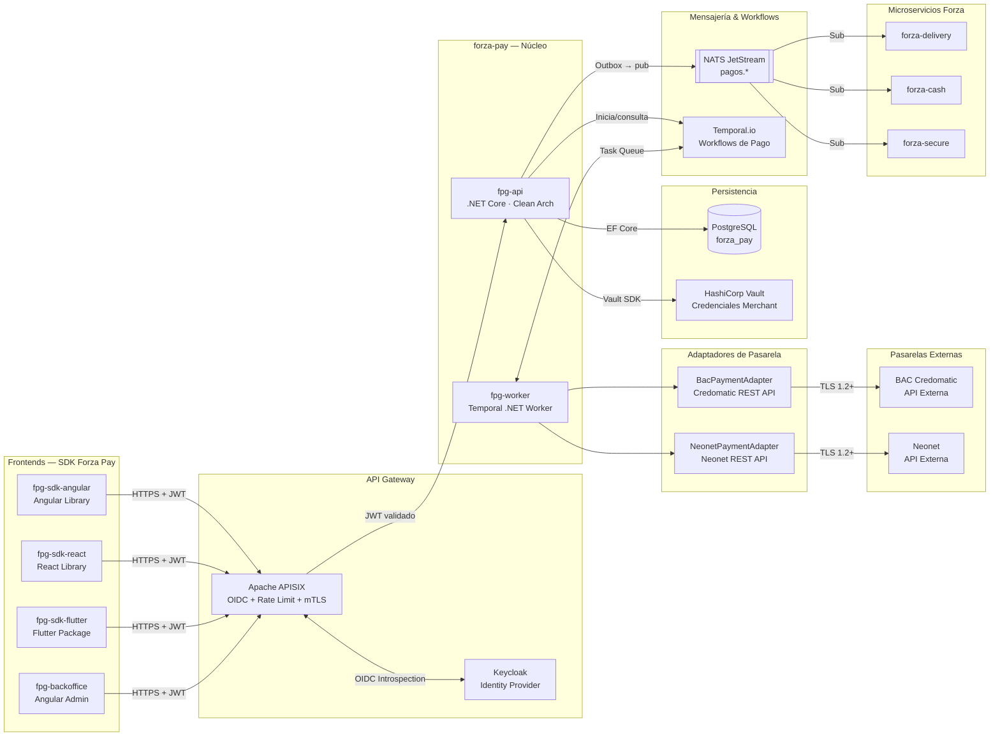

---

## Multi-Tenant y White-Label

Cada empresa del grupo es un **tenant** con cuentas merchant propias y branding independiente. El SDK de frontend consulta la configuración pública del tenant al inicializarse y aplica el tema visualmente sin necesidad de rebuild.

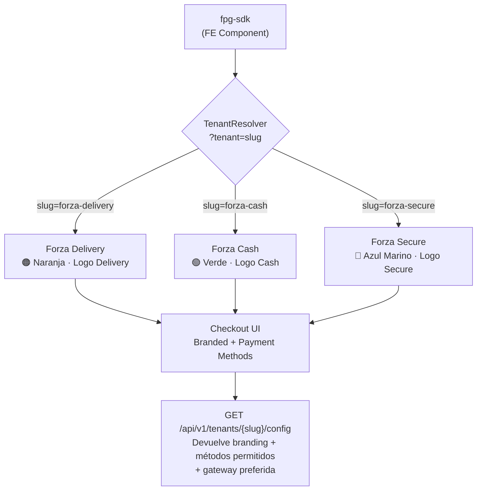

### Contrato de Configuración de Tenant (respuesta pública)

```json
{
  "tenantId": "uuid",
  "slug": "forza-delivery",
  "displayName": "Forza Delivery",
  "branding": {
    "logoUrl": "https://cdn.forza.gt/delivery/logo.svg",
    "primaryColor": "#FF6B00",
    "secondaryColor": "#1A3A5C",
    "fontFamily": "Inter"
  },
  "allowedPaymentMethods": ["CARD", "ACH", "WALLET", "CASH", "SUBSCRIPTION"],
  "preferredGateway": "BAC"
}
```

---

## Flujo de Autenticación

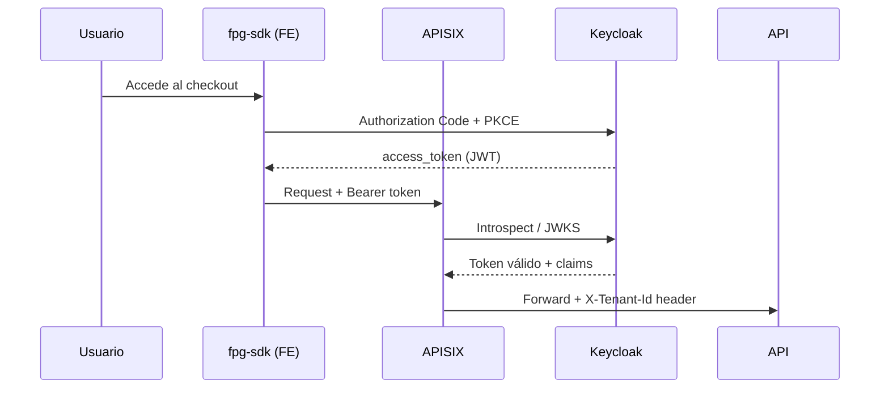

---

## Flujo de Pago con Tarjeta (Tokenización)

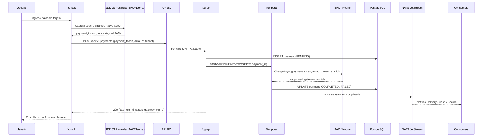

---

## Flujo de Pago en Efectivo / Referencia Bancaria

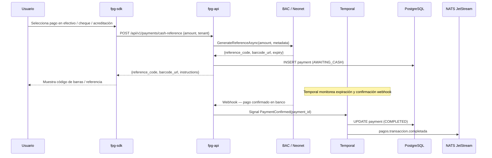

---

## Flujo de Cobro Recurrente / Suscripción

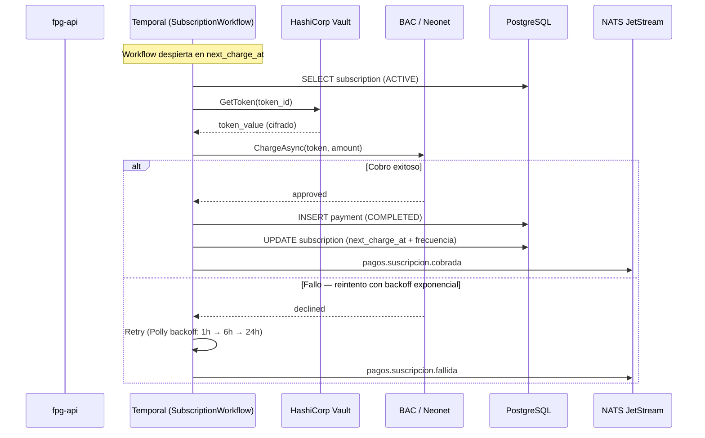

---

## Flujo de Reembolso

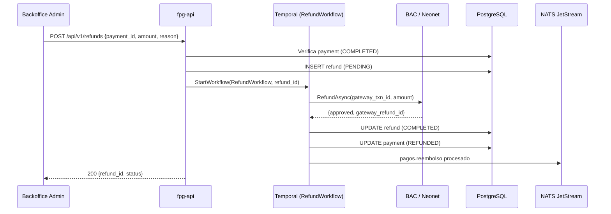

---

## Adaptadores de Pasarela — Strategy Pattern

El núcleo del servicio nunca depende de una pasarela concreta; todo acceso se realiza a través de la interfaz `IPaymentGateway`. El `GatewayResolver` elige el adaptador correcto según la configuración del tenant y el método de pago solicitado.

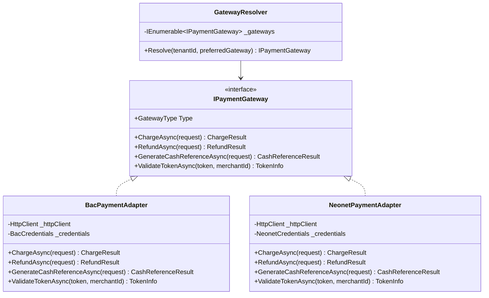

### Configuración de Credenciales por Tenant

Las credenciales merchant **nunca se almacenan en código ni en base de datos en texto plano**. Se almacenan en HashiCorp Vault y se referencian por path.

| Tenant | Pasarela Primaria | Pasarela Fallback | Vault Path |
|---|---|---|---|
| forza-delivery | BAC | Neonet | `secret/pay/delivery/bac` |
| forza-cash | Neonet | BAC | `secret/pay/cash/neonet` |
| forza-secure | BAC | BAC | `secret/pay/secure/bac` |

---

## Modelo de Datos (PostgreSQL — `forza_pay`)

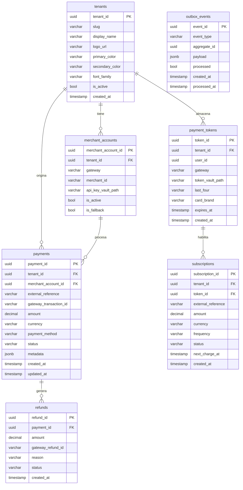

### Enums de Dominio

| Campo | Valores |
|---|---|
| `payment_method` | `CARD`, `ACH`, `WALLET_APPLE`, `WALLET_GOOGLE`, `CASH`, `CHECK`, `SUBSCRIPTION` |
| `status` | `PENDING`, `PROCESSING`, `AWAITING_CASH`, `COMPLETED`, `FAILED`, `REFUNDED`, `EXPIRED` |
| `gateway` | `BAC`, `NEONET` |
| `frequency` | `WEEKLY`, `MONTHLY`, `BIMONTHLY`, `ANNUAL` |

---

## Estructura de Proyectos

```
forza-pay/
├── fpg-api/                              # Microservicio principal .NET Core
│   └── src/
│       ├── ForzaPay.Domain/
│       │   ├── Entities/
│       │   │   ├── Payment.cs
│       │   │   ├── Tenant.cs
│       │   │   ├── MerchantAccount.cs
│       │   │   ├── PaymentToken.cs
│       │   │   ├── Subscription.cs
│       │   │   └── Refund.cs
│       │   ├── Enums/
│       │   │   ├── PaymentStatus.cs
│       │   │   ├── PaymentMethod.cs
│       │   │   └── GatewayType.cs
│       │   └── Interfaces/
│       │       ├── IPaymentRepository.cs
│       │       ├── ITenantRepository.cs
│       │       └── IPaymentGateway.cs
│       ├── ForzaPay.Application/
│       │   ├── Commands/
│       │   │   ├── CreatePayment/
│       │   │   ├── CreateCashReference/
│       │   │   ├── ProcessRefund/
│       │   │   └── CreateSubscription/
│       │   ├── Queries/
│       │   │   ├── GetPaymentById/
│       │   │   ├── GetTenantTransactions/
│       │   │   └── GetSubscriptionById/
│       │   └── Interfaces/
│       │       ├── IGatewayResolver.cs
│       │       └── ITokenVaultService.cs
│       ├── ForzaPay.Infrastructure/
│       │   ├── Gateways/
│       │   │   ├── BacPaymentAdapter.cs
│       │   │   ├── NeonetPaymentAdapter.cs
│       │   │   └── GatewayResolver.cs
│       │   ├── Repositories/
│       │   │   ├── PaymentRepository.cs
│       │   │   └── TenantRepository.cs
│       │   ├── Vault/
│       │   │   └── VaultTokenService.cs
│       │   ├── Outbox/
│       │   │   └── OutboxProcessor.cs         # Hosted Service — Outbox Pattern
│       │   └── Temporal/
│       │       ├── PaymentWorkflow.cs
│       │       ├── SubscriptionWorkflow.cs
│       │       └── RefundWorkflow.cs
│       └── ForzaPay.Presentation/
│           ├── Controllers/
│           │   ├── PaymentsController.cs
│           │   ├── SubscriptionsController.cs
│           │   ├── RefundsController.cs
│           │   ├── TenantsController.cs
│           │   └── WebhooksController.cs      # Endpoints para callbacks BAC/Neonet
│           └── Middlewares/
│               └── TenantResolutionMiddleware.cs
│
├── fpg-worker/                           # Temporal .NET Worker
│   ├── Workflows/
│   │   ├── PaymentWorkflow.cs
│   │   ├── SubscriptionWorkflow.cs
│   │   └── RefundWorkflow.cs
│   └── Activities/
│       ├── ChargeCardActivity.cs
│       ├── GenerateCashReferenceActivity.cs
│       ├── ProcessRefundActivity.cs
│       └── SendPaymentNotificationActivity.cs
│
├── fpg-backoffice/                       # Angular — Panel Administrativo
│   └── src/
│       └── features/
│           ├── transactions/             # Historial y detalle de transacciones
│           ├── refunds/                  # Gestión de reembolsos
│           ├── subscriptions/            # Administración de suscripciones
│           ├── tenants/                  # Configuración de tenants y branding
│           └── reports/                 # Dashboard y reportes
│
├── fpg-sdk-angular/                      # Angular Library — npm package
│   └── projects/fpg-checkout/
│       ├── checkout.component.ts
│       ├── payment-methods.component.ts
│       ├── tenant.config.ts
│       └── theme.service.ts
│
├── fpg-sdk-react/                        # React Library — npm package
│   └── src/
│       ├── components/
│       │   ├── FpgCheckout/
│       │   └── PaymentMethods/
│       └── hooks/
│           ├── usePayment.ts
│           └── useTenantConfig.ts
│
└── fpg-sdk-flutter/                      # Flutter Package — pub.dev
    └── lib/
        ├── fpg_checkout.dart
        ├── widgets/
        │   ├── fpg_checkout_widget.dart
        │   └── fpg_payment_methods_widget.dart
        └── theme/
            └── fpg_tenant_theme.dart
```

---

## Contrato de API REST

Base URL: `https://api.forza.gt/pay/v1` (enrutado vía APISIX)

### Endpoints Principales

| Método | Endpoint | Descripción |
|---|---|---|
| `GET` | `/tenants/{slug}/config` | Configuración pública de branding y métodos permitidos |
| `POST` | `/payments` | Crear y ejecutar un pago |
| `GET` | `/payments/{payment_id}` | Consultar estado de un pago |
| `POST` | `/payments/cash-reference` | Generar referencia de pago en efectivo/cheque |
| `POST` | `/refunds` | Solicitar reembolso (requiere rol `pay:refund`) |
| `GET` | `/refunds/{refund_id}` | Consultar estado de un reembolso |
| `POST` | `/subscriptions` | Crear suscripción recurrente |
| `PUT` | `/subscriptions/{id}/cancel` | Cancelar suscripción |
| `POST` | `/webhooks/bac` | Callback de confirmación BAC (firmado HMAC) |
| `POST` | `/webhooks/neonet` | Callback de confirmación Neonet (firmado HMAC) |

### Payload — Crear Pago

```json
POST /payments
{
  "tenantSlug": "forza-delivery",
  "paymentToken": "tok_bac_xxxx",
  "amount": 150.00,
  "currency": "GTQ",
  "paymentMethod": "CARD",
  "externalReference": "ORDER-2026-001",
  "saveTokenForSubscription": false,
  "metadata": {
    "orderId": "uuid",
    "customerId": "uuid"
  }
}
```

```json
HTTP 201
{
  "paymentId": "uuid",
  "status": "COMPLETED",
  "gatewayTransactionId": "BAC-TXN-12345",
  "amount": 150.00,
  "currency": "GTQ",
  "processedAt": "2026-04-28T10:00:00Z"
}
```

---

## Eventos NATS JetStream

Stream: `PAGOS` · Subjects: `pagos.>`

| Subject | Publicado por | Descripción |
|---|---|---|
| `pagos.transaccion.creada` | `fpg-api` | Pago registrado (PENDING) |
| `pagos.transaccion.completada` | `fpg-worker` | Pago aprobado por pasarela |
| `pagos.transaccion.fallida` | `fpg-worker` | Pago rechazado o error de pasarela |
| `pagos.transaccion.expirada` | `fpg-worker` | Referencia de efectivo sin confirmar |
| `pagos.reembolso.procesado` | `fpg-worker` | Reembolso aprobado |
| `pagos.suscripcion.cobrada` | `fpg-worker` | Cobro recurrente exitoso |
| `pagos.suscripcion.fallida` | `fpg-worker` | Cobro recurrente rechazado |
| `pagos.suscripcion.cancelada` | `fpg-api` | Suscripción cancelada |

### Schema de Evento Base

```json
{
  "eventId": "uuid",
  "eventType": "pagos.transaccion.completada",
  "tenantSlug": "forza-delivery",
  "occurredAt": "2026-04-28T10:00:00Z",
  "payload": {
    "paymentId": "uuid",
    "externalReference": "ORDER-2026-001",
    "amount": 150.00,
    "currency": "GTQ",
    "gateway": "BAC"
  }
}
```

---

## Seguridad y Cumplimiento PCI DSS

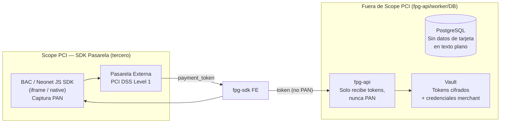

| Medida | Implementación |
|---|---|
| **PCI Scope reducido** | Tokenización 100% en SDK de pasarela. El backend nunca ve el PAN. |
| **Secretos** | Credenciales merchant y tokens en HashiCorp Vault. Nunca en código. |
| **Autenticación** | Keycloak OIDC · Authorization Code + PKCE · Roles: `pay:read`, `pay:write`, `pay:refund`, `pay:admin` |
| **Transporte** | TLS 1.2+ externo · mTLS entre servicios internos del cluster |
| **Webhook firmados** | Validación HMAC-SHA256 de cada callback de BAC y Neonet |
| **Validación inputs** | Todos los endpoints validados con FluentValidation (OWASP A03) |
| **Rate limiting** | Configurado en APISIX por tenant y por IP (OWASP A04) |
| **Logging** | Serilog JSON estructurado — sin datos sensibles en logs |
| **Idempotencia** | Header `Idempotency-Key` en POST /payments para evitar cobros dobles |

---

## SDK Frontend — Integración Rápida

### Angular

```typescript
// app.module.ts
import { FpgCheckoutModule } from '@forza/fpg-sdk-angular';

@NgModule({
  imports: [
    FpgCheckoutModule.forRoot({
      apiBaseUrl: environment.fpgApiUrl,
      tenantSlug: 'forza-delivery'
    })
  ]
})
export class AppModule {}
```

```html
<!-- checkout.component.html -->
<fpg-checkout
  [amount]="total"
  [currency]="'GTQ'"
  [externalReference]="orderId"
  (paymentSuccess)="onSuccess($event)"
  (paymentError)="onError($event)">
</fpg-checkout>
```

### React

```tsx
import { FpgCheckout } from '@forza/fpg-sdk-react';

export function CheckoutPage() {
  return (
    <FpgCheckout
      tenantSlug="forza-cash"
      amount={150.00}
      currency="GTQ"
      externalReference={orderId}
      onSuccess={(result) => navigate('/confirmation', { state: result })}
      onError={(err) => setError(err.message)}
    />
  );
}
```

### Flutter

```dart
import 'package:fpg_sdk_flutter/fpg_checkout.dart';

FpgCheckout(
  tenantSlug: 'forza-secure',
  amount: 150.00,
  currency: 'GTQ',
  externalReference: orderId,
  onSuccess: (result) => _handleSuccess(result),
  onError: (error) => _handleError(error),
)
```

---

## Backoffice — `fpg-backoffice`

Panel administrativo Angular para operaciones del equipo de Finanzas y Soporte.

| Módulo | Funcionalidades |
|---|---|
| **Transacciones** | Listado paginado con filtros por tenant, estado, método, rango de fechas. Detalle de cada pago. |
| **Reembolsos** | Solicitud y seguimiento de reembolsos. Aprobación multi-nivel (configurable por tenant). |
| **Suscripciones** | Vista de suscripciones activas, pausa, cancelación, historial de cobros. |
| **Tenants** | Gestión de branding (logo, colores), métodos de pago habilitados, configuración de gateway. |
| **Reportes** | Dashboard con KPIs: volumen de cobro por tenant/pasarela, tasa de aprobación, tasa de reembolso. Exportación CSV/Excel. |

---

## Resiliencia

| Componente | Estrategia |
|---|---|
| **Llamadas a BAC / Neonet** | Polly: Retry × 3 (backoff exponencial 1s → 2s → 4s) + Circuit Breaker (5 fallos → 30s abierto) + Timeout 30s |
| **Workflows de pago** | Temporal.io garantiza ejecución at-least-once con historial de actividades persistido |
| **Outbox Pattern** | Hosted Service publica eventos NATS solo después del COMMIT en PostgreSQL |
| **Webhook BAC/Neonet** | Idempotencia por `gateway_transaction_id`; reintentos automáticos desde la pasarela hasta 72h |
| **Fallback de gateway** | Si la pasarela primaria del tenant falla, `GatewayResolver` intenta la secundaria (configurable) |

---

## Pipeline CI/CD

```mermaid
flowchart LR
    PR["Pull Request"] --> CODACY["1. Codacy\nSin Críticos ni Altos"]
    CODACY --> BUILD["2. dotnet build\nfpg-api + fpg-worker"]
    BUILD --> TEST["3. xUnit Tests\nCobertura ≥ 80%"]
    TEST --> TRIVY["4. Trivy Scan\nImagen Docker"]
    TRIVY --> DOCKER["5. Docker Multi-stage\nfpg-api + fpg-worker\n+ fpg-backoffice"]
    DOCKER --> GHCR["6. Push GHCR\nv1.2.3-sha"]
    GHCR --> DEV["7. Deploy Dev\nRancher Fleet"]
    DEV --> SMOKE["8. Smoke Tests\n/health + /payments/ping"]
    SMOKE --> GATE["9. Gate Manual\nAprobación a Producción"]
```

---

## Dependencias Externas

| Servicio | Uso | Protocolo |
|---|---|---|
| BAC Credomatic API | Procesamiento de pagos, reembolsos, referencias | HTTPS REST + HMAC |
| Neonet API | Procesamiento de pagos, reembolsos, referencias | HTTPS REST + HMAC |
| HashiCorp Vault | Credenciales merchant + tokens de tarjeta | Vault SDK / HTTP |
| Keycloak | Autenticación y autorización | OIDC / OAuth 2.0 |
| Temporal.io | Workflows de pago y suscripción | gRPC |
| NATS JetStream | Eventos de pago para microservicios consumidores | NATS |
| PostgreSQL | Persistencia transaccional | TCP (EF Core) |

---

*Versión: 1.0 — 2026-04-28 | Diseñado por: GitHub Copilot + David Salas*
*Stack de referencia: ForzaTech Copilot Skill v3*
