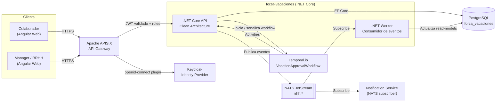
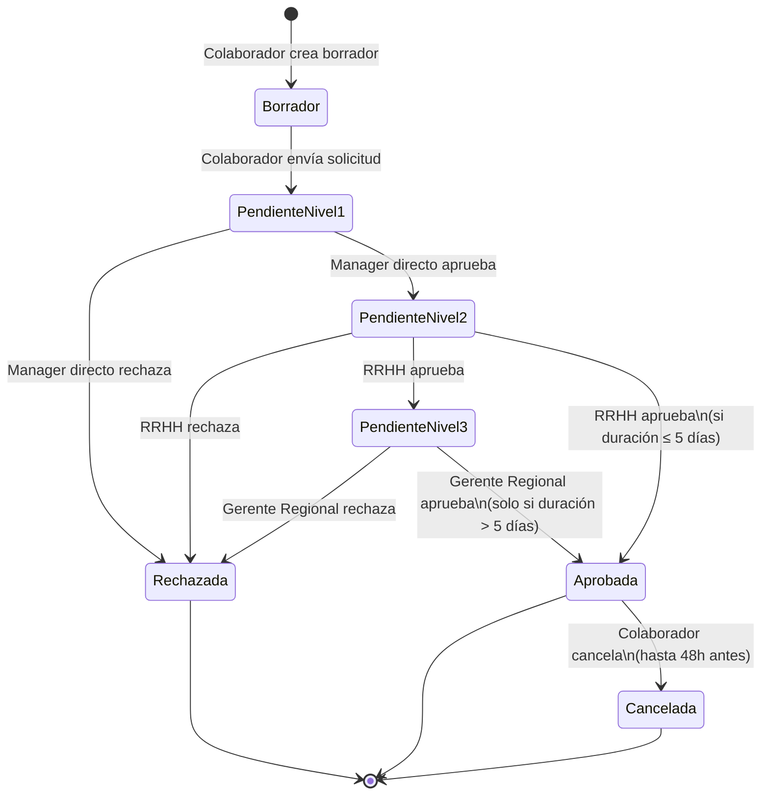
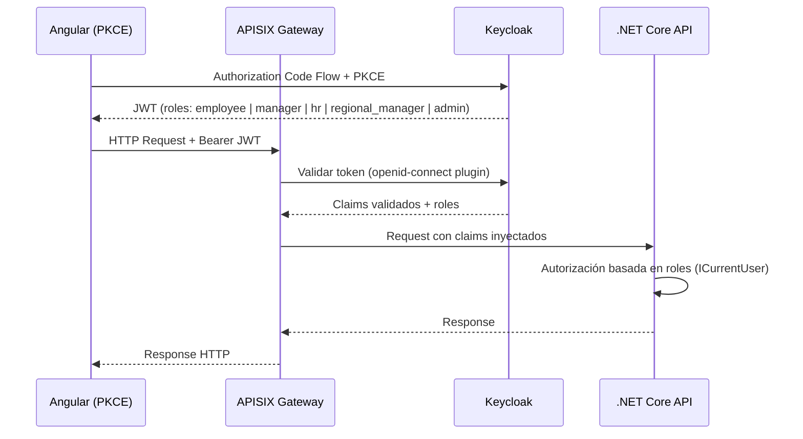
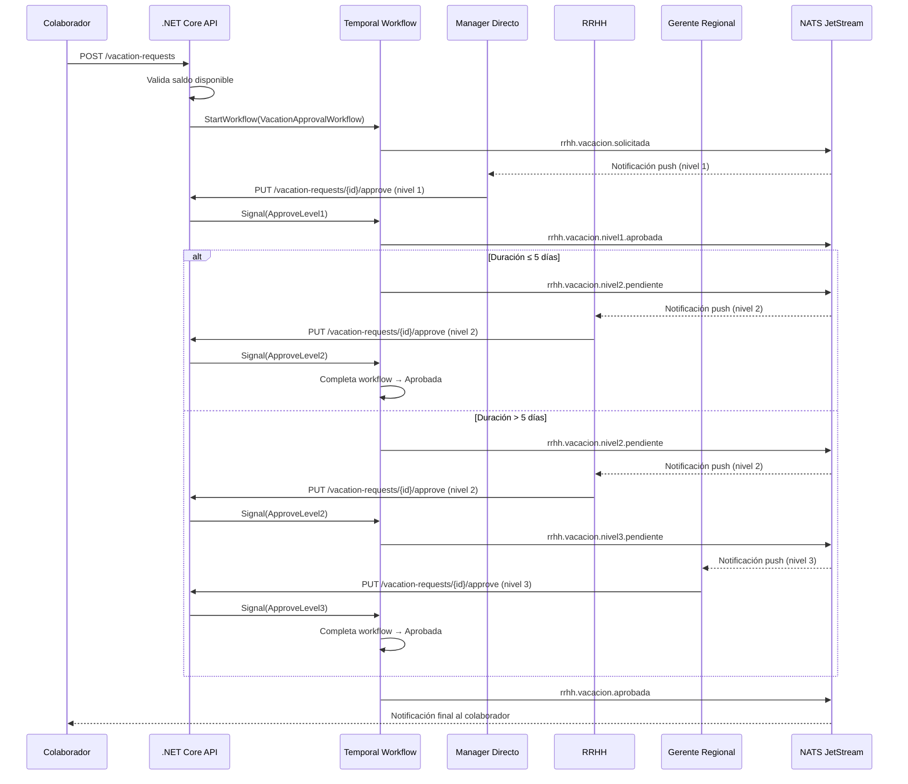
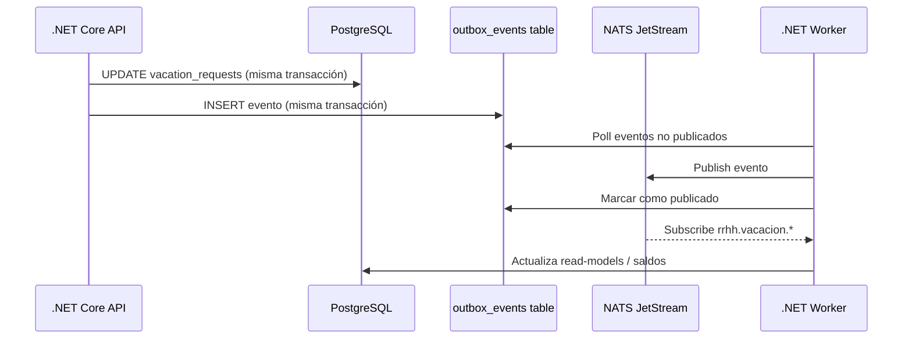
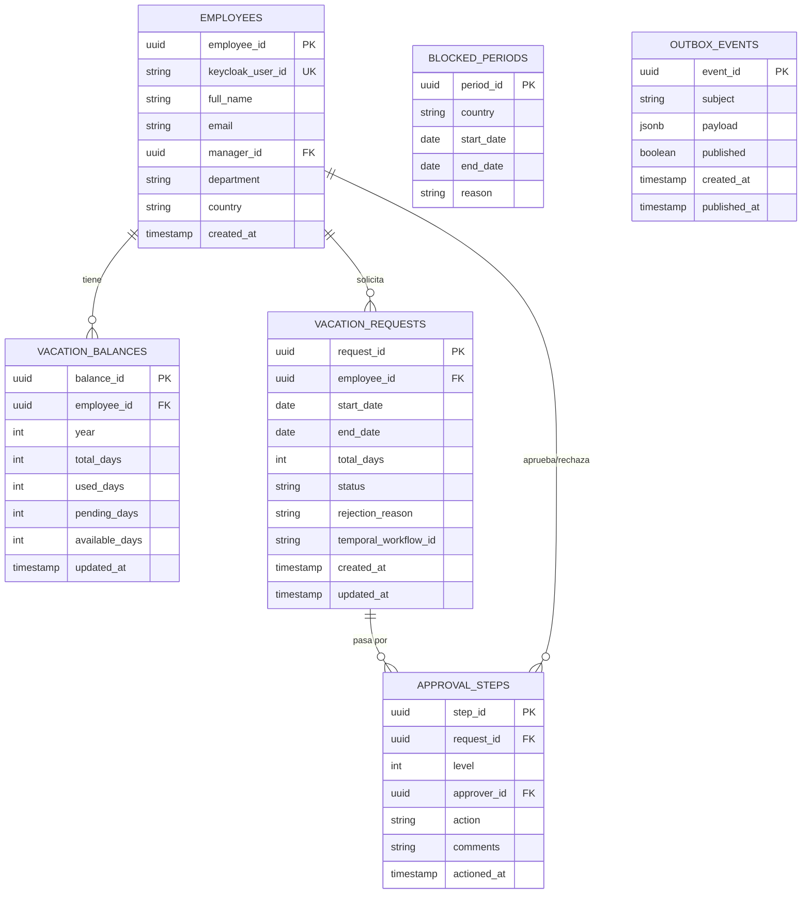

# ARCHITECTURE.md — Gestión de Vacaciones (Forza Vacaciones)

> Generado con GitHub Copilot usando el stack ForzaTech v3.
> Actualizar este archivo en cada cambio arquitectónico significativo.

---

## Descripción del Servicio

**Nombre:** `forza-vacaciones`
**Dominio:** `Recursos Humanos / Operaciones`
**Track:** Innovación
**Responsable:** David Salas — Gerente de Desarrollo y Tecnología
**Última actualización:** 2026-04-27

Sistema web para que los colaboradores de Forza Logistics Group soliciten períodos de vacaciones. El flujo de aprobación es **multi-nivel** y se orquesta con Temporal.io, garantizando que ningún paso se pierda aunque ocurran fallos de infraestructura. Los managers aprueban o rechazan desde la misma aplicación web; en cada transición se envía notificación en tiempo real vía NATS.

---

## Arquitectura General



---

## Estados de una Solicitud de Vacaciones



---

## Flujo de Autenticación y Roles



**Roles en Keycloak:**

| Rol | Descripción |
|-----|-------------|
| `employee` | Puede crear y cancelar sus propias solicitudes |
| `manager` | Aprobación Nivel 1 — equipo directo a cargo |
| `hr` | Aprobación Nivel 2 — todas las solicitudes |
| `regional_manager` | Aprobación Nivel 3 — solicitudes > 5 días |
| `admin` | Gestión del sistema, saldos, períodos bloqueados |

---

## Flujo de Aprobación Multi-Nivel (Temporal.io)



---

## Flujo de Eventos con Outbox Pattern



---

## Modelo de Datos



---

## Stack de Dependencias

### Runtime

| Componente | Tecnología | Versión | Notas |
|------------|-----------|---------|-------|
| Framework | .NET Core | 8.0 LTS | `net8.0` target |
| ORM | Entity Framework Core | 8.x | Migrations en `Infrastructure/Persistence/Migrations` |
| CQRS | MediatR | 12.x | Commands y Queries en `Application/` |
| Workflows | Temporalio SDK | 1.x | `VacationApprovalWorkflow` con signals |
| Mensajería | NATS.Net | 2.x | JetStream — subjects `rrhh.*` |
| Resiliencia | Polly | 8.x | Retry + Circuit Breaker en Activities de Temporal |
| Logging | Serilog | 3.x | JSON estructurado + correlationId por solicitud |
| Tests | xUnit + Moq | Latest | Cobertura mínima: 80% |
| Frontend | Angular 17+ | LTS | NgRx Signals, Standalone Components, Lazy Loading |

### Infraestructura

| Componente | Herramienta | Configuración |
|------------|------------|---------------|
| API Gateway | Apache APISIX | Routes por rol en `apisix/routes-vacaciones.yaml` |
| Identity | Keycloak | Realm: `forza-prod`, Client: `vacaciones-spa` |
| Workflows | Temporal.io | Namespace: `forza-vacaciones` |
| Orquestación | Kubernetes + Rancher | Namespace: `prod-vacaciones` |
| CI/CD | GitHub Actions | `.github/workflows/ci-vacaciones.yaml` |
| Calidad | Codacy | Gate: sin issues Críticos/Altos |
| Imágenes | GHCR | `ghcr.io/forzatech/forza-vacaciones:v1.0.0-sha` |

---

## Estructura del Proyecto (Clean Architecture)

```
src/
├── ForzaVacaciones.Domain/
│   ├── Entities/
│   │   ├── VacationRequest.cs
│   │   ├── ApprovalStep.cs
│   │   ├── VacationBalance.cs
│   │   └── BlockedPeriod.cs
│   ├── ValueObjects/
│   │   ├── VacationRequestId.cs
│   │   └── DateRange.cs
│   ├── Enums/
│   │   └── VacationRequestStatus.cs
│   └── Interfaces/
│       ├── IVacationRequestRepository.cs
│       └── IVacationBalanceRepository.cs
│
├── ForzaVacaciones.Application/
│   ├── Commands/
│   │   ├── CreateVacationRequest/
│   │   │   ├── CreateVacationRequestCommand.cs
│   │   │   └── CreateVacationRequestCommandHandler.cs
│   │   ├── ApproveVacationRequest/
│   │   │   ├── ApproveVacationRequestCommand.cs
│   │   │   └── ApproveVacationRequestCommandHandler.cs
│   │   └── RejectVacationRequest/
│   ├── Queries/
│   │   ├── GetMyVacationRequests/
│   │   ├── GetPendingApprovals/
│   │   └── GetVacationBalance/
│   ├── DTOs/
│   │   ├── VacationRequestDto.cs
│   │   └── ApprovalStepDto.cs
│   └── Interfaces/
│       └── ICurrentUser.cs
│
├── ForzaVacaciones.Infrastructure/
│   ├── Persistence/
│   │   ├── AppDbContext.cs
│   │   ├── Migrations/
│   │   ├── Repositories/
│   │   └── OutboxRelay/
│   ├── Temporal/
│   │   ├── Workflows/
│   │   │   └── VacationApprovalWorkflow.cs
│   │   └── Activities/
│   │       ├── NotifyApproverActivity.cs
│   │       └── UpdateRequestStatusActivity.cs
│   └── Messaging/
│       └── NatsPublisher.cs
│
└── ForzaVacaciones.Presentation/
    ├── Controllers/
    │   ├── VacationRequestsController.cs
    │   └── ApprovalsController.cs
    └── Middleware/
        └── CurrentUserMiddleware.cs

frontend/
└── forza-vacaciones-web/           # Angular 17+
    ├── src/app/
    │   ├── features/
    │   │   ├── my-vacations/       # Vista colaborador
    │   │   ├── approvals/          # Vista manager / RRHH
    │   │   └── admin/              # Vista admin
    │   ├── core/
    │   │   ├── auth/               # Keycloak PKCE
    │   │   └── interceptors/       # JWT + correlationId
    │   └── shared/

tests/
├── ForzaVacaciones.UnitTests/
└── ForzaVacaciones.IntegrationTests/
```

---

## Convenciones de Naming en este Servicio

```csharp
// Commands y Queries
CreateVacationRequestCommand
ApproveVacationRequestCommand
RejectVacationRequestCommand
GetMyVacationRequestsQuery
GetPendingApprovalsQuery

// Entidades
VacationRequest
ApprovalStep
VacationBalance

// Value Objects
VacationRequestId
DateRange

// Temporal
VacationApprovalWorkflow
NotifyApproverActivity

// NATS Subjects (rrhh.entidad.accion)
rrhh.vacacion.solicitada
rrhh.vacacion.nivel1.aprobada
rrhh.vacacion.nivel1.rechazada
rrhh.vacacion.nivel2.aprobada
rrhh.vacacion.nivel2.rechazada
rrhh.vacacion.nivel3.aprobada
rrhh.vacacion.nivel3.rechazada
rrhh.vacacion.aprobada
rrhh.vacacion.rechazada
rrhh.vacacion.cancelada
```

---

## Endpoints Principales (REST)

| Método | Ruta | Rol requerido | Descripción |
|--------|------|---------------|-------------|
| `POST` | `/vacation-requests` | `employee` | Crear solicitud |
| `GET` | `/vacation-requests/mine` | `employee` | Mis solicitudes |
| `DELETE` | `/vacation-requests/{id}` | `employee` | Cancelar (≥ 48h antes) |
| `GET` | `/vacation-requests/pending-approvals` | `manager`, `hr`, `regional_manager` | Solicitudes pendientes por aprobar |
| `PUT` | `/vacation-requests/{id}/approve` | `manager`, `hr`, `regional_manager` | Aprobar en el nivel correspondiente |
| `PUT` | `/vacation-requests/{id}/reject` | `manager`, `hr`, `regional_manager` | Rechazar con motivo |
| `GET` | `/vacation-balances/mine` | `employee` | Mi saldo de vacaciones |
| `GET` | `/vacation-balances/{employeeId}` | `hr`, `admin` | Saldo de un colaborador |
| `POST` | `/blocked-periods` | `admin` | Definir período bloqueado |

---

## Variables de Entorno Requeridas

> Los valores NUNCA van en el código ni en Git. Usar Vault o K8s Secrets.

```bash
# Base de datos
ConnectionStrings__DefaultConnection=   # Vault: secret/vacaciones/pg-connection

# Keycloak
Keycloak__Authority=                    # https://keycloak.forzatech.com/realms/forza-prod
Keycloak__Audience=                     # forza-vacaciones

# NATS
Nats__Url=                              # nats://nats.forzatech.svc.cluster.local:4222
Nats__StreamName=                       # RRHH

# Temporal
Temporal__HostPort=                     # temporal.forzatech.svc.cluster.local:7233
Temporal__Namespace=                    # forza-vacaciones

# Notificaciones
Notifications__WebhookUrl=              # Vault: secret/vacaciones/notif-webhook
```

---

## Pipeline CI/CD

```
PR abierto
  └─> Codacy (gate: sin Críticos/Altos)
  └─> Build .NET (dotnet build)
  └─> Tests unitarios (cobertura >= 80%)
  └─> Build Angular (ng build --configuration production)
  └─> Trivy scan de imagen Docker

Merge a main
  └─> Build imagen Docker multi-stage (API + Angular en nginx)
  └─> Push a GHCR: ghcr.io/forzatech/forza-vacaciones:v{semver}-{sha}
  └─> Deploy automático a dev/staging (Rancher Fleet)
  └─> Smoke tests (POST solicitud de prueba → verificar estado)

Deploy a producción
  └─> Gate manual (GitHub Environments: producción)
  └─> Rancher Fleet sincroniza desde Git
  └─> Notificación al equipo vía NATS
```

---

## ADRs (Architecture Decision Records)

| Decisión | Fecha | Estado | Documento |
|----------|-------|--------|-----------|
| Temporal.io para el flujo de aprobación multi-nivel | 2026-04-27 | Aceptado | `docs/adr/001-temporal-aprobaciones.md` |
| Outbox Pattern para garantía de entrega de eventos | 2026-04-27 | Aceptado | `docs/adr/002-outbox-pattern.md` |
| Aprobación nivel 3 solo para solicitudes > 5 días | 2026-04-27 | Aceptado | `docs/adr/003-regla-nivel3.md` |

---

*Generado con GitHub Copilot usando `.github/copilot-instructions.md` del repositorio*
*Stack: ForzaTech v3 — Referencia: Política_Forza_Tech_v3.docx*
